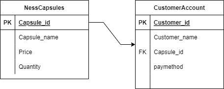
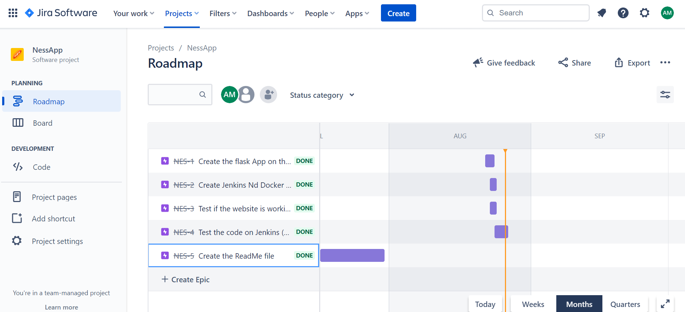
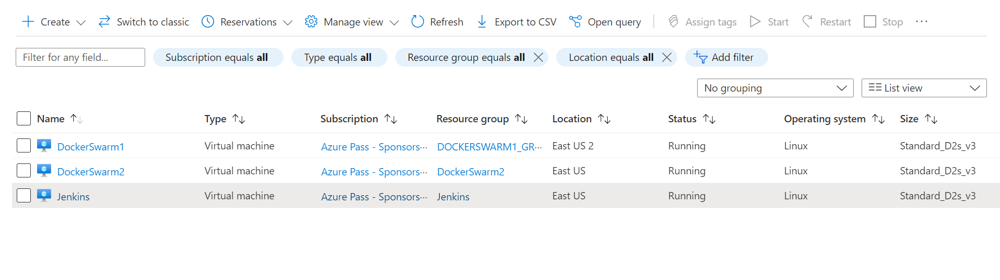
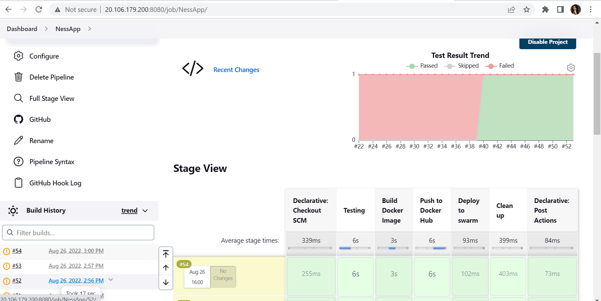

# Final Project Cohort 9/Cloud Bootcamp

###NessApp 

Step #1:
Create an ERD Diagramm for the Ness App

Step #2:
Jira Progress

Step#3:
Project Description:Create a website for  orderning online the Coffee Capsules for the Home  Coffee machine called 'Nesspresso'

Step#4:
Create a website with the flask application called NessApp then turn it to a Docker Container and deploy it by using Docker Compose. 

Step#5:
Have created three Vitual Machines in order to deploy my code to Docker Compose

DockerSwam1 being the 'manager' and DockerSwam2 being the 'worker'

Step#6: After making sure my NessApp website is launched then checking whether my pipeline is working

Step#7:
Possible improvements: Elaborate my code more in order to have a full crud oparation webflask.This time i have applied agile methodology investing more time on managing to have a fully working Pipeline and have a basic website launched. Definetely i will work more on my website.
